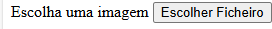
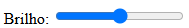

#  Manual de Utilizador - PixeLoucura 

## 📌 Introdução  
Bem-vindo ao Manual de Utilizador PixeLoucura ! Este manual explica como Utilizar e reportar o nosso Aplicativo.  

---

## 🚀 1.  PixeLoucura

### 🔹 1.1 Oque é  
- O PixeLoucura é um progama desenvolvido por 3 alunos , para um projeto final sobre Tratamento de imagens .

### 🔹 1.2 Criadores 
- Afonso Palma , Rodrigo Ramos , Rafael Ascenção. 

## 🎶 2. Funcionalidades  

### 🔹 2.1   Indice
- Para inserir uma imagem na aplicaçao,basta so segir os paços desta imagem .
 

- Como Ulizar o Brilho?, qaundo o utilizador selecionar a foto que quer editar vai estar visivel uma aba a dizer Brinho como esta representado na imagem seguite. 

     

- Como mudo o contraste de uma imagem? para conseguir mudares o contraste tens d arastar a bola bala a frente (para mais contraste) ou para tras (menso contraste)como esta na imagem seguinte.
   
- Como Utilizar o Desfoque no site? , para utilizar o desfoque tem uma aba que tem barra de movimento com o nome de **Desfoque** como esta na imagem seguinte . 
    
    

- Pode .  
- Pode .  
### 🔹 2.2 Criar Playlists  
1. Vá até a aba **Minhas Playlists**.  
2. Clique em **Criar Nova Playlist**.  
3. Adicione músicas à sua nova lista.  

### 🔹 2.3 Configurações  
- Ajuste a qualidade do áudio em **Configurações > Qualidade**.  
- Altere o tema da interface em **Configurações > Aparência**.  

---

## 🔧 3. Solução de Problemas  

| Problema        | Solução |
|----------------|---------|
| O som não funciona | Verifique se os alto-falantes estão ligados e o volume está ativo. |
| A aplicação não abre | Tente reinstalar a aplicação e verifique se há atualizações disponíveis. |

---

## 📩 4. Suporte  
Se precisar de ajuda, contacte-nos através de:  
📧 Email: suporte@exemplo.com  
📞 Telefone: +351 123 456 789  
🌍 Website: [Nosso site](https://exemplo.com)  
